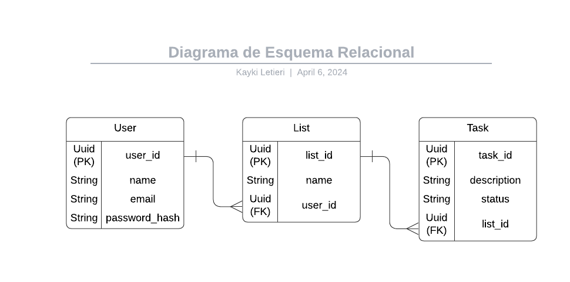

# Arquitetura da Solução

Pré-requisitos: <a href="3-Projeto de Interface.md"> Projeto de Interface</a>

Definição de como o software é estruturado em termos dos componentes que fazem parte da solução e do ambiente de hospedagem da aplicação.

## Diagrama de Classes

## Modelo ER

.png)

## Esquema Relacional

## Modelo Físico

## Tecnologias Utilizadas

Para o desenvolvimento do aplicativo de gerenciamento de tarefas "Magic List" utilizando React Native e Expo, serão utilizadas as seguintes tecnologias:

### Linguagem de Programação:

-   JavaScript: Será a linguagem principal utilizada para desenvolver a lógica do aplicativo, tanto no frontend quanto no backend, caso necessário.

### Frameworks e Bibliotecas:

-   React Native: Framework utilizado para o desenvolvimento de aplicativos móveis multiplataforma, permitindo a criação de interfaces de usuário nativas utilizando componentes React.
-   Expo: Plataforma e conjunto de ferramentas que facilitam o desenvolvimento e a distribuição de aplicativos React Native, proporcionando um ambiente de desenvolvimento simplificado e acesso a APIs nativas.

### Serviços Web:

-   Firebase: Serviço de desenvolvimento de aplicativos móveis do Google, que oferece diversas ferramentas úteis, como autenticação de usuários, armazenamento em nuvem, banco de dados em tempo real e hospedagem de aplicativos.

### IDE de Desenvolvimento:

-   Visual Studio Code: IDE de código aberto e gratuita desenvolvida pela Microsoft, conhecida por sua grande variedade de extensões e recursos que auxiliam no desenvolvimento de aplicativos JavaScript e React Native.

### Ferramentas Adicionais:

-   Git: Sistema de controle de versão distribuído utilizado para o acompanhamento do código-fonte do projeto, permitindo colaboração entre desenvolvedores e controle de alterações.
-   GitHub: Plataforma de hospedagem de código-fonte baseada em Git, que oferece recursos adicionais como controle de problemas, solicitações de pull e integração contínua.

### Arquitetura de Interação do Usuário:

O aplicativo "Magic List" seguirá uma arquitetura de interação simples e intuitiva para os usuários. A figura abaixo ilustra o fluxo básico de interação do usuário com o sistema:

cssCopy code

`[Interface do Usuário] --> [Lógica de Negócio] --> [Serviços Web]
     ^                                                          |
     |__________________________________________________________|` 

-   A interação do usuário começa na interface do aplicativo, onde ele pode criar, visualizar, editar e excluir listas e tarefas.
-   A lógica de negócio implementada em JavaScript no React Native é responsável por processar as ações do usuário e manipular os dados conforme necessário.
-   Quando necessário, como ao salvar dados ou autenticar usuários, o aplicativo se comunica com os Serviços Web, como Firebase, por meio de chamadas de API assíncronas.
-   Os serviços web processam as solicitações do aplicativo, realizam operações no banco de dados, como armazenamento e recuperação de dados, e retornam uma resposta ao aplicativo.

Esta arquitetura de interação proporciona uma experiência de usuário eficiente e responsiva, garantindo a funcionalidade adequada do aplicativo "Magic List".

## Hospedagem

Para hospedar o aplicativo "Magic List" na plataforma Microsoft Azure, adotamos o seguinte processo:

### Escolha da Plataforma de Hospedagem:

A decisão de hospedar na Microsoft Azure foi baseada na sua reputação como uma das principais plataformas de nuvem, oferecendo uma variedade de serviços e recursos para hospedar aplicativos web e móveis de forma escalável e confiável.

### Configuração do Ambiente de Desenvolvimento:

O ambiente de desenvolvimento do aplicativo foi configurado com base nas ferramentas e serviços oferecidos pela Microsoft Azure, como o Visual Studio e o Azure DevOps, garantindo uma integração suave entre o ambiente de desenvolvimento e a plataforma de hospedagem.

### Preparação do Código-fonte para Implantação:

Antes de implantar na Azure, o código-fonte do aplicativo foi revisado e preparado para implantação. Foram realizados testes locais para garantir o funcionamento adequado do aplicativo e a configuração correta de todas as dependências.

### Implantação na Azure:

O processo de implantação na Azure incluiu os seguintes passos:

1.  Configuração de uma conta na Azure e criação de um novo aplicativo web.
2.  Configuração do ambiente de implantação, incluindo a definição das configurações do aplicativo, como versão do Node.js e ambiente de execução.
3.  Conexão do repositório Git do aplicativo ao repositório remoto da Azure.
4.  Implantação do aplicativo na Azure utilizando integração contínua/desenvolvimento contínuo (CI/CD) com o Azure DevOps ou GitHub Actions.
5.  Verificação dos logs e métricas de desempenho na Azure para garantir que a implantação foi bem-sucedida.

### Configuração de Serviços Adicionais:

Além da hospedagem básica do aplicativo, foram configurados serviços adicionais na Azure, como o Azure SQL Database para armazenamento de dados, Azure App Service Authentication para autenticação de usuários e Azure Monitor para monitoramento e análise de desempenho do aplicativo em tempo real.

### Configuração de Domínio Personalizado (opcional):

Para personalizar ainda mais a hospedagem, foi considerada a configuração de um domínio personalizado na Azure. Isso envolveu a configuração de registros DNS para direcionar o tráfego do domínio para o aplicativo hospedado na Azure.

### Monitoramento e Manutenção:

Após a implantação, o aplicativo foi monitorado regularmente utilizando os recursos de monitoramento da Azure para garantir que estivesse funcionando corretamente e para realizar qualquer manutenção necessária. Atualizações futuras e correções de bugs foram implementadas conforme necessário.

## Qualidade de Software

A qualidade de software é um aspecto fundamental no desenvolvimento de qualquer projeto, pois influencia diretamente na satisfação dos usuários e no sucesso do produto. Nesse contexto, a equipe do projeto "Magic List" adotará as seguintes subcaracterísticas de qualidade, baseadas na norma ISO/IEC 25010:

1.  **Funcionalidade**: Refere-se à capacidade do software de fornecer funções que atendam às necessidades declaradas e implícitas dos usuários.
    
    -   **Conformidade**: Verifica se o software está em conformidade com os requisitos especificados.
    -   **Adequação**: Avalia se as funcionalidades fornecidas atendem às necessidades do usuário.
    -   **Interoperabilidade**: Verifica a capacidade do software de interagir com outros sistemas.
    
    **Métricas**: Número de requisitos atendidos, taxa de defeitos relacionados à funcionalidade, taxa de sucesso de interoperabilidade.
    
2.  **Confiabilidade**: Diz respeito à capacidade do software de manter o desempenho especificado quando usado em condições específicas.
    
    -   **Maturidade**: Mede a frequência de falhas.
    -   **Disponibilidade**: Avalia o tempo em que o sistema está disponível para uso.
    -   **Tolerância a falhas**: Verifica a capacidade do sistema de lidar com falhas sem interrupções graves.
    
    **Métricas**: Tempo médio entre falhas (MTBF), tempo de disponibilidade, taxa de falhas recuperáveis.
    
3.  **Usabilidade**: Refere-se à facilidade de uso do software e à experiência do usuário ao interagir com o sistema.
    
    -   **Compreensibilidade**: Avalia o quão fácil é entender o sistema.
    -   **Aprendizagem**: Verifica o tempo necessário para os usuários aprenderem a usar o sistema.
    -   **Operacionalidade**: Avalia o quão fácil é operar o sistema.
    
    **Métricas**: Tempo médio para realizar uma tarefa, taxa de conclusão bem-sucedida de tarefas, pontuação de satisfação do usuário.
    

Essas subcaracterísticas foram escolhidas pela equipe por serem essenciais para garantir um alto nível de qualidade no aplicativo "Magic List". As métricas associadas a cada subcaracterística permitirão à equipe avaliar objetivamente o desempenho do software em relação a esses aspectos, identificar áreas de melhoria e garantir que as expectativas dos usuários sejam atendidas de forma consistente.
